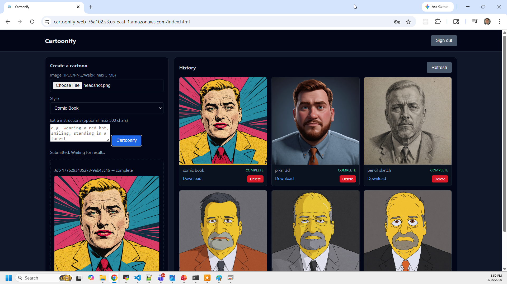
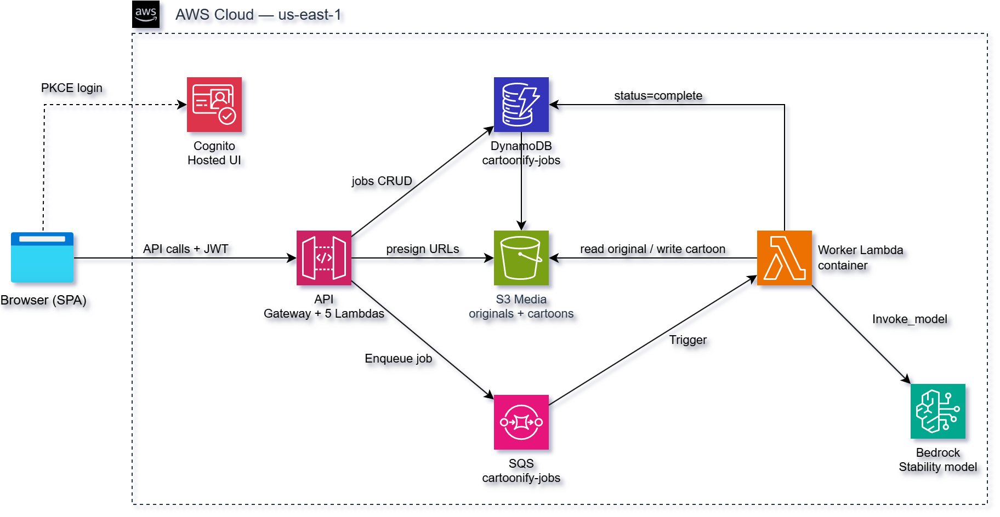

# AWS Serverless Image-to-Cartoon Pipeline with Bedrock, Lambda, SQS, and Cognito

This project delivers a fully automated **serverless, event-driven image
cartoonification service** on AWS, built using **Amazon API Gateway**,
**AWS Lambda**, **Amazon SQS**, **Amazon DynamoDB**, **Amazon Cognito**, and
**Amazon Bedrock**.

It uses **Terraform** and **Python (boto3)** to provision and deploy an
**asynchronous image-processing pipeline** where users upload a photo, select
a cartoon style, and a queue-driven worker invokes a **Bedrock image generation
model** (default: Stability `stable-image-control-structure-v1:0` via the
`us.*` cross-region inference profile) to produce a stylized cartoon — all
without running or managing any EC2 instances or servers.

Authentication and authorization are handled natively by **Amazon Cognito**,
allowing users to sign in with email-based credentials and obtain JWT access
tokens that are validated directly by API Gateway before any Lambda is invoked.

A lightweight **HTML web frontend** integrates with Cognito's Hosted UI,
allows direct browser-to-S3 uploads via presigned POST, polls for job
completion, and displays the user's full cartoon history — all over a
JWT-secured REST API.



The Bedrock model is fully parameterized — see
[Changing the Bedrock Model](#changing-the-bedrock-model). Swapping models
requires only editing three export lines in `bedrock-config.sh`.

This design follows a **serverless, event-driven microservice architecture**
where API Gateway routes authenticated requests to stateless Lambda functions,
SQS decouples the upload from the slow Bedrock inference call, DynamoDB
provides fully managed job state, and S3 stores both originals and generated
cartoons. AWS handles scaling, availability, and fault tolerance automatically.

## Key Capabilities Demonstrated

1. **Asynchronous Image-Processing Pipeline** – Upload → SQS queue → Bedrock
   worker Lambda → S3 result. The browser polls `/result/{job_id}` until the
   job completes, decoupling the user experience from inference latency.
2. **Bedrock Image Generation with Structural Control** – Stability's
   `stable-image-control-structure-v1:0` preserves the subject's pose and
   composition while regenerating the image in the requested cartoon style.
   The cross-region `us.*` inference profile routes transparently across
   `us-east-1`, `us-east-2`, and `us-west-2`.
3. **Authenticated Serverless API** – Five REST endpoints protected by Cognito
   JWT authorizers, backed by zip-packaged Python Lambda functions sharing a
   single IAM role and deployment artifact.
4. **Container-Image Worker Lambda** – The Bedrock worker runs from a Docker
   image (Python 3.11 + Pillow) stored in ECR. Pillow normalizes uploaded
   images — EXIF strip, RGB conversion, center-square crop, 1024×1024 resize —
   before the Bedrock call. Bumping `WORKER_TAG` in `apply.sh` triggers an
   automatic rebuild and Lambda update on the next deploy.
5. **Per-User Daily Quota Without a GSI** – `submit.py` enforces a 10-cartoon-
   per-user-per-UTC-day limit using a single DynamoDB `Query` on the
   time-sortable `job_id` sort key — no Global Secondary Index required.
6. **Direct Browser-to-S3 Uploads** – The `/upload-url` Lambda returns a
   presigned S3 POST with a `content-length-range` condition. The browser
   uploads directly to S3, keeping the image data off the Lambda network path.
7. **Native AWS Authentication** – Cognito User Pools issue and manage JWT
   tokens; API Gateway validates signatures against Cognito JWKS before any
   Lambda runs, eliminating custom authentication logic in application code.
8. **Infrastructure as Code (IaC)** – Terraform provisions all resources across
   four discrete stages (backend → worker image → API → webapp). Each stage
   has local state and can be applied or destroyed independently.

Together, these components form a **clean, minimal reference architecture** for
building **secure, event-driven serverless applications on AWS** — suitable for
learning, prototyping, or extending into more advanced AI-integrated pipelines.

## Architecture



```
Browser → S3 (SPA, public) → Cognito Hosted UI → callback.html (PKCE) → sessionStorage (JWT)

Browser ──POST /upload-url──→ API Gateway (JWT) → upload_url Lambda → presigned S3 POST
Browser ──PUT (direct)─────→ S3 media bucket (private, originals/<owner>/<job_id>.<ext>)

Browser ──POST /generate───→ API Gateway (JWT) → submit Lambda → DynamoDB (status=submitted)
                                                                └→ SQS cartoonify-jobs
                                                                        ↓
                                                     Worker Lambda (container image, ECR)
                                                     • Pillow: EXIF strip, 1024×1024 crop/resize
                                                     • Bedrock invoke_model (control-structure)
                                                     • S3 put cartoons/<owner>/<job_id>.png
                                                     • DynamoDB (status=complete)

Browser ──GET /result/{job_id}─→ result Lambda  → status + presigned GET URLs
Browser ──GET /history────────→ history Lambda → newest 50 for owner
Browser ──DELETE /history/{id}→ delete Lambda  → S3 objects + DynamoDB row
```

## Deployment Stages

| Stage | What it does |
|---|---|
| **01-backend** | SQS queue, DynamoDB table, ECR repo, S3 web + media buckets, Cognito User Pool |
| **02-worker**  | `docker buildx build --platform linux/amd64`, push to ECR |
| **03-api**     | API Gateway HTTP API v2 + JWT authorizer + 5 API Lambdas + worker Lambda + SQS trigger |
| **04-webapp**  | Generate `index.html` / `config.json` via `envsubst`, upload SPA assets to web bucket |

## Job Lifecycle

Every job moves through the following states. The DynamoDB `status` field is
the single source of truth — the SPA gallery and `/result/{job_id}` both read
it directly.

```
[start] ──POST /generate──→ submitted  (submit Lambda writes row + enqueues SQS)
                                ↓
                            processing  (worker pulls SQS message, marks status)
                                ↓
                    complete ─────── error  (exception → first 500 chars in error_message)
                        ↓               ↓
                  7-day TTL auto-deletes row; S3 lifecycle deletes objects
```

The worker **swallows exceptions** so SQS does not redrive — `status=error` on
the job row is the canonical failure signal for the SPA. The SPA gallery
auto-refreshes every 10 s while any tile is `submitted` or `processing`, then
stops automatically once all jobs reach a terminal state.

## API Gateway Endpoints

The **Cartoonify API** exposes REST-style endpoints through **Amazon API
Gateway (HTTP API v2)** and is secured using a **Cognito JWT authorizer**. All
requests must include a valid **Authorization: Bearer \<JWT\>** header issued
by the Cognito User Pool.

### Endpoint Summary

| Method | Path | Lambda | Purpose | Auth |
|---|---|---|---|---|
| POST | `/upload-url` | upload_url | Presigned S3 POST with 5 MB cap and content-type policy | Required |
| POST | `/generate` | submit | Validate style, check quota, write job row, enqueue SQS | Required |
| GET | `/result/{job_id}` | result | Single-job status + presigned GET URLs for original/cartoon | Required |
| GET | `/history` | history | Last 50 jobs for the authenticated user, newest first | Required |
| DELETE | `/history/{job_id}` | delete | Remove S3 objects (original + cartoon) and DynamoDB row | Required |

---

### POST /upload-url

**Purpose:**  
Generates a presigned S3 POST allowing the browser to upload an image directly
to the private media bucket without routing file data through Lambda.

**Request Headers:**
```
Authorization: Bearer <JWT_ACCESS_TOKEN>
Content-Type: application/json
```

**Request Body (JSON):**
```json
{ "content_type": "image/jpeg" }
```

**Parameters:**

| Field | Type | Required | Allowed values |
|---|---|---|---|
| content_type | string | Yes | `image/jpeg`, `image/png`, `image/webp` |

**Example Request:**
```bash
curl -s -X POST https://<api-id>.execute-api.us-east-1.amazonaws.com/upload-url \
  -H "Authorization: Bearer <JWT>" \
  -H "Content-Type: application/json" \
  -d '{"content_type":"image/jpeg"}'
```

**Example Response (200):**
```json
{
  "job_id": "0196a3f2e1a4-a1b2c3d4",
  "key": "originals/<sub>/0196a3f2e1a4-a1b2c3d4.jpg",
  "url": "https://cartoonify-media-<hex>.s3.amazonaws.com/",
  "fields": {
    "Content-Type": "image/jpeg",
    "key": "originals/<sub>/0196a3f2e1a4-a1b2c3d4.jpg",
    "Policy": "...",
    "X-Amz-Signature": "..."
  }
}
```

The browser POSTs `fields` + the file directly to `url`. The presigned POST
enforces `content-length-range [0, 5242880]` and an exact content-type match.

---

### POST /generate

**Purpose:**  
Validates the uploaded image, checks the daily quota, writes a job row in
DynamoDB with `status=submitted`, and enqueues the job on SQS.

**Request Body (JSON):**
```json
{
  "job_id": "0196a3f2e1a4-a1b2c3d4",
  "key": "originals/<sub>/0196a3f2e1a4-a1b2c3d4.jpg",
  "style": "pixar_3d",
  "prompt_extra": "wearing a red cape, smiling"
}
```

**Parameters:**

| Field | Type | Required | Description |
|---|---|---|---|
| job_id | string | Yes | From `/upload-url` response |
| key | string | Yes | S3 key from `/upload-url` response |
| style | string | Yes | One of the six style IDs (see below) |
| prompt_extra | string | No | User-supplied prompt augmentation, max 500 chars |

**Supported Styles:**

| Style ID | Description |
|---|---|
| `pixar_3d` | Pixar 3D animated portrait with subsurface shading and cinematic lighting |
| `simpsons` | The Simpsons style — bright yellow skin, bold black outlines, flat colors |
| `comic_book` | Marvel comic book illustration with Ben-Day dots and dramatic ink shadows |
| `anime` | Japanese anime portrait with cel-shading, large luminous eyes, sharp lineart |
| `watercolor` | Fine art watercolor with wet-on-wet washes and visible paper texture |
| `pencil_sketch` | Detailed graphite sketch with cross-hatching and tonal shading |

**Example Request:**
```bash
curl -s -X POST https://<api-id>.execute-api.us-east-1.amazonaws.com/generate \
  -H "Authorization: Bearer <JWT>" \
  -H "Content-Type: application/json" \
  -d '{"job_id":"0196a3f2e1a4-a1b2c3d4","key":"originals/<sub>/0196a3f2e1a4-a1b2c3d4.jpg","style":"pixar_3d"}'
```

**Example Response (202):**
```json
{ "job_id": "0196a3f2e1a4-a1b2c3d4", "status": "submitted" }
```

**Quota exceeded (429):**
```json
{ "error": "Daily limit of 10 reached", "used": 10, "resets": "at 00:00 UTC" }
```

---

### GET /result/{job_id}

**Purpose:**  
Returns the current status of a single job plus short-lived presigned GET URLs
for the original upload and the generated cartoon (when complete).

**Example Request:**
```bash
curl -s https://<api-id>.execute-api.us-east-1.amazonaws.com/result/0196a3f2e1a4-a1b2c3d4 \
  -H "Authorization: Bearer <JWT>"
```

**Example Response (200):**
```json
{
  "job_id": "0196a3f2e1a4-a1b2c3d4",
  "status": "complete",
  "style": "pixar_3d",
  "created_at": 1745000000,
  "original_url": "https://cartoonify-media-<hex>.s3.amazonaws.com/originals/...?Expires=...",
  "cartoon_url":  "https://cartoonify-media-<hex>.s3.amazonaws.com/cartoons/...?Expires=..."
}
```

Presigned GET URLs expire after 4 hours. The `cartoon_url` field is absent
while the job is `submitted` or `processing`.

---

### GET /history

**Purpose:**  
Lists the last 50 cartoons for the authenticated user, newest first, each with
presigned GET URLs.

**Example Request:**
```bash
curl -s https://<api-id>.execute-api.us-east-1.amazonaws.com/history \
  -H "Authorization: Bearer <JWT>"
```

**Example Response (200):**
```json
{
  "items": [
    {
      "job_id": "0196a3f2e1a4-a1b2c3d4",
      "status": "complete",
      "style": "pixar_3d",
      "created_at": 1745000000,
      "cartoon_url": "https://..."
    }
  ],
  "count": 1
}
```

---

### DELETE /history/{job_id}

**Purpose:**  
Deletes the original upload and generated cartoon from S3, then removes the
DynamoDB job row. Returns `404` if the job does not belong to the
authenticated user.

**Example Request:**
```bash
curl -s -X DELETE https://<api-id>.execute-api.us-east-1.amazonaws.com/history/0196a3f2e1a4-a1b2c3d4 \
  -H "Authorization: Bearer <JWT>"
```

**Example Response (200):**
```json
{ "job_id": "0196a3f2e1a4-a1b2c3d4", "deleted": true }
```

---

## Prerequisites

* [An AWS Account](https://aws.amazon.com/console/) with Bedrock enabled
* [Install AWS CLI](https://docs.aws.amazon.com/cli/latest/userguide/getting-started-install.html)
* [Install Terraform](https://developer.hashicorp.com/terraform/install)
* [Install Docker](https://docs.docker.com/engine/install/) (with `buildx` support)
* `jq` and `envsubst` available in your PATH
* **Bedrock model access enabled** for Stability
  `stable-image-control-structure-v1:0` in the Bedrock console:
  https://console.aws.amazon.com/bedrock/home?region=us-east-1#/modelaccess

Region is hardcoded to `us-east-1` — the `us.*` cross-region inference profile
routes Bedrock calls from there across `us-east-1`, `us-east-2`, and
`us-west-2`.

If this is your first time using AWS with Terraform, we recommend starting with
this video:  
**[AWS + Terraform: Easy Setup](https://www.youtube.com/watch?v=9clW3VQLyxA)**
– it walks through configuring your AWS credentials, Terraform backend, and
CLI environment.

## Download this Repository

```bash
git clone https://github.com/mamonaco1973/aws-cartoonify.git
cd aws-cartoonify
```

## Build the Code

Run [check_env](check_env.sh) to validate your environment, then run
[apply](apply.sh) to provision all four stages.

```bash
~/aws-cartoonify$ ./apply.sh
NOTE: Running environment validation...
NOTE: Validating that required commands are found in your PATH.
NOTE: aws is found in the current PATH.
NOTE: terraform is found in the current PATH.
NOTE: docker is found in the current PATH.
NOTE: jq is found in the current PATH.
NOTE: envsubst is found in the current PATH.
NOTE: All required commands are available.
NOTE: Checking AWS CLI connection.
NOTE: Successfully logged into AWS.
NOTE: Checking Bedrock inference profile access...
NOTE: Inference profile found: us.stability.stable-image-control-structure-v1:0
NOTE: Running Bedrock dry-run invocation to confirm model access...
NOTE: Bedrock model access confirmed.

NOTE: Phase 1 - Building core infrastructure.
Initializing the backend...

...

NOTE: Phase 2 - Building and pushing the worker image.
NOTE: Image worker-rc3 not found in ECR. Building and pushing...
[+] Building 42.3s (9/9) FINISHED

NOTE: Phase 3 - Deploying API Gateway and Lambda functions.
Initializing the backend...

...

NOTE: Phase 4 - Deploying the web application.
Initializing the backend...

...

================================================================================
  Cartoonify - Deployment validated!
================================================================================
  API : https://<api-id>.execute-api.us-east-1.amazonaws.com
  Web : https://cartoonify-web-<hex>.s3.us-east-1.amazonaws.com/index.html
================================================================================
```

Open the web URL, sign up, sign in, upload a photo, pick a style, and click
**Cartoonify**. The generated cartoon appears in the gallery in roughly 15–30
seconds.

### Build Results

When the deployment completes, the following resources are created:

- **Core Infrastructure (Stage 01):**
  - Fully serverless architecture — no EC2 instances, VPCs, or load balancers
  - **Amazon SQS queue** (`cartoonify-jobs`) decoupling uploads from Bedrock
    inference; visibility timeout set to 180 s (exceeding the 120 s worker
    timeout) to prevent duplicate processing
  - **Amazon DynamoDB table** (`cartoonify-jobs`) storing job state with
    time-sortable sort keys and a 7-day TTL
  - **Amazon ECR repository** (`cartoonify`) for the container-image worker
  - **S3 web bucket** (`cartoonify-web-<hex>`) — public, for SPA hosting
  - **S3 media bucket** (`cartoonify-media-<hex>`) — private, with CORS and
    7-day lifecycle rules on `originals/` and `cartoons/`
  - **Cognito User Pool** (`cartoonify-user-pool`) with email-based sign-in,
    self-service signup, and a Hosted UI domain for PKCE auth

- **Worker Image (Stage 02):**
  - Docker image built for `linux/amd64` from the official AWS Lambda Python
    3.11 base image, with Pillow installed for image normalization
  - Pushed to ECR under a configurable tag (`worker-rc3` by default); the
    build is skipped automatically if the tag already exists in ECR

- **API and Lambdas (Stage 03):**
  - **API Gateway HTTP API v2** with a Cognito JWT authorizer, CORS configured
    for browser clients, and five routes mapped to dedicated Lambda functions
  - **Five zip-packaged API Lambdas** (Python 3.11) sharing a single deployment
    artifact and IAM role, with least-privilege access to DynamoDB, S3, and SQS
  - **Worker Lambda** (container image from ECR) with 2048 MB memory and a
    120 s timeout, triggered by an SQS event source mapping (`batch_size=1`)
  - **IAM policies** scoped per role: API Lambdas can send to SQS but not
    invoke Bedrock; the worker can invoke Bedrock but cannot delete from S3 or
    DynamoDB

- **Web Application (Stage 04):**
  - Vanilla JS SPA (no build step, no npm) uploaded to the S3 web bucket
  - `index.html` generated from `index.html.tmpl` via `envsubst` — API base
    URL is injected at deploy time
  - `config.json` generated at deploy time with Cognito domain, client ID, and
    redirect URI — never committed to source control
  - `callback.html` handles the Cognito PKCE redirect, exchanges the
    authorization code for tokens, and stores them in `sessionStorage`

- **Security and Authorization:**
  - API Gateway validates JWT signatures against Cognito JWKS before any Lambda
    is invoked — no authentication logic in application code
  - DynamoDB partition key (`owner`) is always set to the Cognito `sub` claim —
    users can only read or delete their own jobs
  - S3 media objects are never publicly accessible — all access is through
    short-lived presigned URLs generated by the API
  - Bedrock IAM is scoped to the configured inference profile plus the
    underlying foundation model ARNs across the three routing regions only

Together, these resources form a **secure, AI-integrated, event-driven
serverless application** that demonstrates modern AWS design principles —
**asynchronous by default, identity-aware at every layer, and fully managed**,
with no servers to provision or maintain.

## Changing the Bedrock Model

The model is parameterized end-to-end. To retarget, edit the three `export`
lines in [bedrock-config.sh](bedrock-config.sh) — sourced by both `apply.sh`
and `destroy.sh`:

```bash
export BEDROCK_MODEL_ID="stability.stable-image-control-structure-v1:0"
export BEDROCK_INFERENCE_PROFILE_ID="us.stability.stable-image-control-structure-v1:0"
export BEDROCK_MODEL_REGIONS='["us-east-1","us-east-2","us-west-2"]'
```

These values flow automatically to:

- **`check_env.sh`** — pre-flight probe that the profile and model are
  accessible before any Terraform runs
- **`03-api/` Terraform** — worker Lambda `BEDROCK_MODEL_ID` env var and the
  `bedrock:InvokeModel` IAM resource ARNs (inference profile + foundation model
  in every routing region)
- **`02-worker/cartoonify/app.py`** — reads `BEDROCK_MODEL_ID` at startup and
  passes it to `bedrock.invoke_model`

If the new model uses a different request/response schema (e.g. Nova Canvas
`IMAGE_VARIATION` vs. Stability's control-structure shape), also update the
`invoke_bedrock` payload in
[02-worker/cartoonify/app.py](02-worker/cartoonify/app.py) and bump `WORKER_TAG`
in [apply.sh](apply.sh) so the container is rebuilt and pushed.

## Destroy

```bash
./destroy.sh
```

Tears down `04-webapp → 03-api → media bucket contents → 01-backend`. The media
bucket is emptied explicitly with `aws s3 rm --recursive` before backend
teardown so that objects with pending lifecycle transitions do not block
`aws_s3_bucket` deletion.

## Cost Notes

- Image generation costs roughly **$0.04 per 1024×1024 output** (verify
  current pricing for your chosen model at the Bedrock pricing page).
- The 10-per-user/day quota caps worst-case Bedrock spend at ≈ **$0.40 per
  user per day**.
- SQS, Lambda, DynamoDB, and S3 costs for this workload are negligible.

## Project Layout

```
aws-cartoonify/
├── 01-backend/          # Terraform: Cognito, DynamoDB, SQS, S3 (web + media), ECR
├── 02-worker/
│   └── cartoonify/      # Dockerfile + app.py (Bedrock worker) + requirements.txt
├── 03-api/
│   ├── code/            # Python Lambda handlers + common.py (shared helpers)
│   ├── api.tf           # HTTP API v2 + JWT authorizer + 5 routes + CORS
│   ├── data.tf          # Data sources: look up backend resources by name
│   ├── lambda-api.tf    # 5 zip-packaged API Lambdas (shared role + artifact)
│   └── lambda-worker.tf # Container-image worker Lambda + SQS event source mapping
├── 04-webapp/           # Vanilla JS SPA + Terraform upload to web bucket
├── apply.sh             # Full 4-stage deploy
├── destroy.sh           # Full teardown (reverse order)
├── validate.sh          # Print app URL + API endpoint after deploy
├── check_env.sh         # Pre-flight: tools, AWS credentials, Bedrock access
├── bedrock-config.sh    # Single source of truth for model IDs and routing regions
└── CLAUDE.md            # Developer guide: data model, IAM scoping, style prompts
```

See [CLAUDE.md](CLAUDE.md) for a deeper walkthrough of the data model,
IAM scoping, the worker image pipeline, and how to modify styles, upload
limits, and the Bedrock payload.
